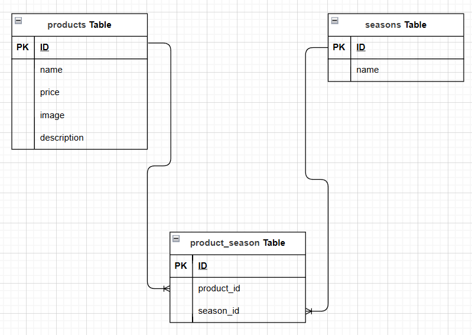

# もぎたてアプリ

## 環境構築

### Docker ビルド

1.  git clone git@github.com:LesserPand8/mogitate2.git
1.  docker-compose up -d --build

＊MYSQL は、OS によって起動しない場合があるのでそれぞれの PC に合わせて docker-conpose.yml ファイルを編集してください。

### Laravel 環境構築

1. docker-compose exec php bash
1. composer install
1. cp .env.example .env
1. .env ファイルを変更

   ```
   DB_CONNECTION=mysql
   - DB_HOST=127.0.0.1
   + DB_HOST=mysql
   DB_PORT=3306
   - DB_DATABASE=laravel
   - DB_USERNAME=root
   - DB_PASSWORD=
   + DB_DATABASE=laravel_db
   + DB_USERNAME=laravel_user
   + DB_PASSWORD=laravel_pass
   ```

1. php artisan key:generate
1. php artisan migrate
1. php artisan db:seed

## 使用技術(実行環境)

- Laravel 8.x
- php 8.1
- MySQL 8.0
- Docker Compose 3.8
- nginx 1.21.1

## ER 図



## URL

- 開発環境：
  - もぎたてアプリ商品一覧:http://localhost/products
- phpMyAdmin：http://localhost:8080/
